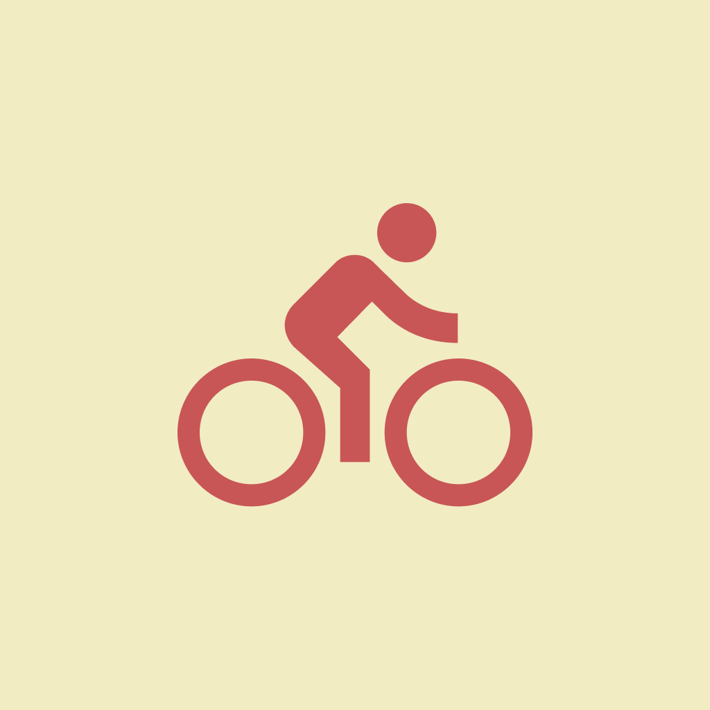

<p align="center">
  
</p>

    
# Bikes Recife

O Bikes Recife é um projeto Open Source para localização de pontos de bicicleta na cidade do Recife. Usando geolocalização, você pode através do App localizar as bikes mais próximas de você e traçar a sua localização até elas pelo google maps. 

[](https://github.com/tterb/atomic-design-ui/blob/master/LICENSEs)

## Authors

- [@samuelLimaSantos](https://www.github.com/samuelLimaSantos)

  
## Demo


  
## Installation 

Install my-project with npm

```bash 
  npm install 
  npm start
```

Install my-project with yarn

```bash 
  yarn 
  yarn start
```
## Lessons Learned

Durante esse projeto pude aprender diversos fundamentos do desenvolvimento mobile utilizando o React Native
em conjunto com o Expo. Além disso, aprendi bastante a utilizar Mapas e Geolocalização.
## License

[MIT](https://choosealicense.com/licenses/mit/)

  